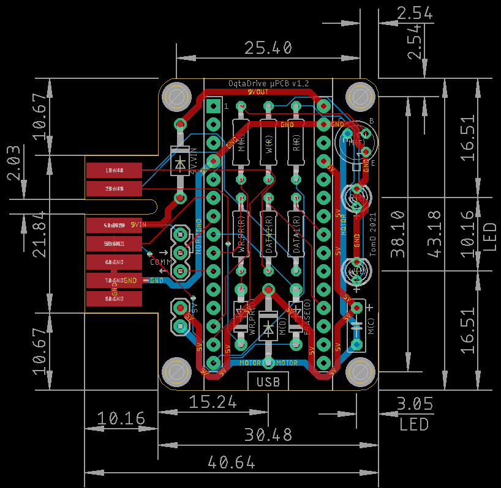
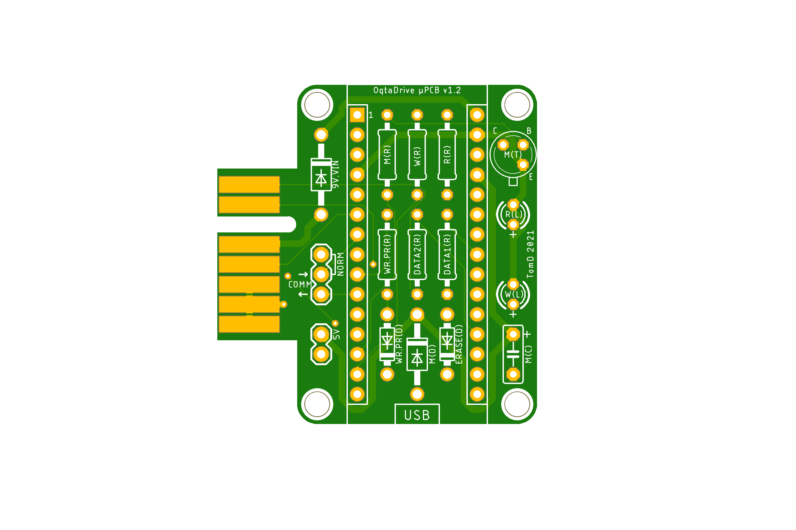
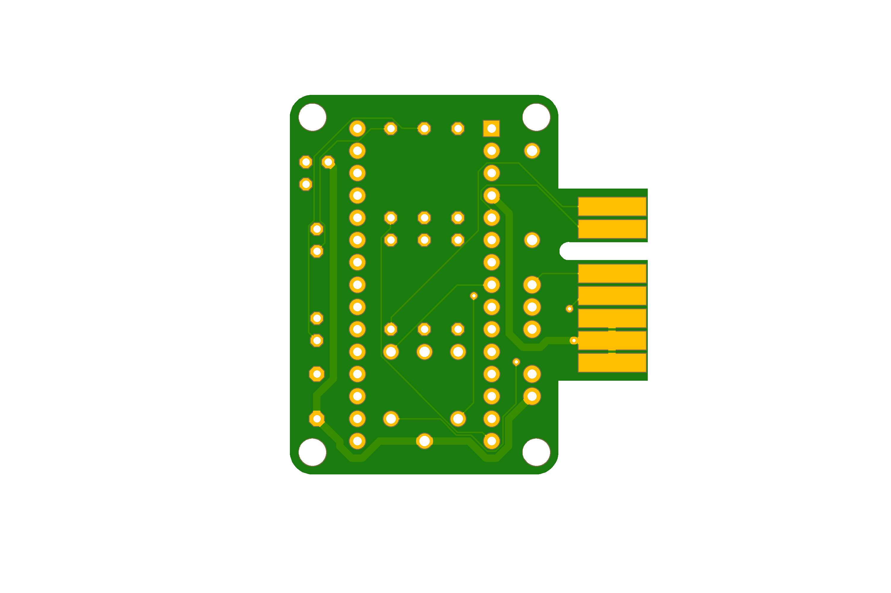

# OqtaDrive-uPCB-v1.2

Micro PCB for OqtaDrive (https://github.com/xelalexv/oqtadrive) including circuitary for vibration motor.

Parts List:
<ul>
<li>WR.PR(D) & ERASE(D) - 1N4148 Small Signal Switching Diode
<li>R(L) & W(L) + R(R) & W(R) - 3mm LED + match resistors
<li>WR.PR(R), DATA1(R) & DATA2(R) - 2k2 Ohm Resistor
<li>M(T) - 2N2222 Transistor
<li>M(R) - 1k Ohm Resistor
<li>M(D) - 1N4004 Diode (or equivalent)
<li>M(C) - 0.1uF Capacitor
<li>2x 15pin header strip for Nano
<li>1x Arduino Nano
<li>1x Adafruit 1201 Vibration Motor (connected to 5V connector)
</ul>
  

